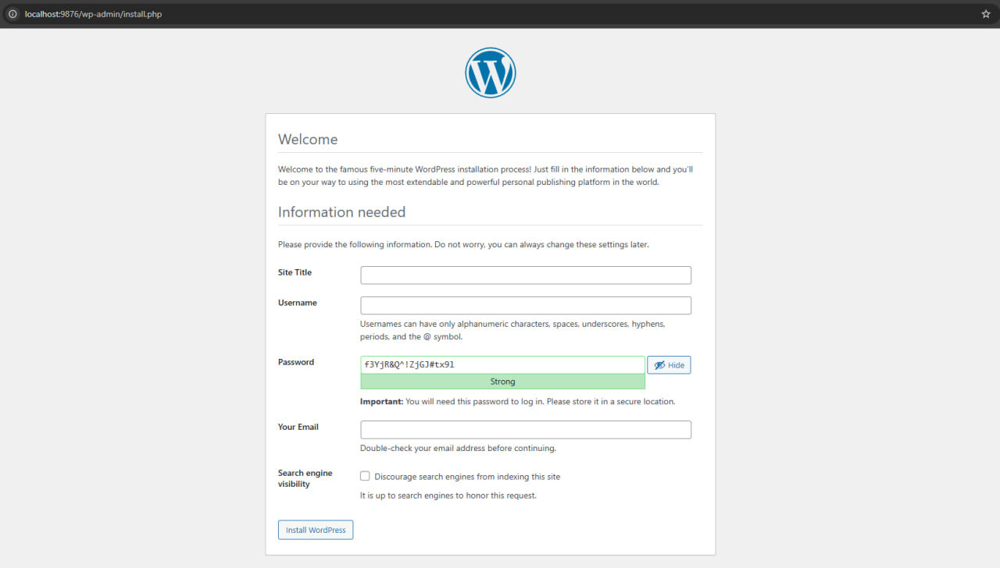

# 🐳 docker-wordpress-easy-to-run

A production-ready Docker setup for running WordPress with support for **ionCube** and **SourceGuardian** loaders.
Built on top of the official [`wordpress`](https://hub.docker.com/_/wordpress) image.

---

## 🚀 Features

- ✅ WordPress with PHP 8.1 (FPM + Alpine)
- ✅ Auto-install of [ionCube](https://basemax.github.io/ioncube-loaders-linux-x86-64/data.json) & [SourceGuardian](https://basemax.github.io/sourceguardian-loader-linux-x86-64/data.json) via GitHub-hosted JSON.
- ✅ MariaDB for local development
- ✅ Clean and minimal — no `curl` or `jq` required
- ✅ Simple and easy to run



---

## 📦 Folder Structure

```
my-wordpress/
├── Dockerfile               # Builds a custom WordPress image with ionCube + SourceGuardian loaders
├── setup-wp-content.sh      # Ensures wp-content/ and subfolders exist with correct permissions (wp-content/uploads, etc.)
├── setup-loaders.php        # Downloads and enables correct loader files based on PHP version (from JSON registries)
├── docker-compose.yml       # Defines WordPress and MariaDB services, ports, and volumes
├── wp-content/              # Optional: Mount your local themes, plugins, uploads here
└── .env                     # Centralized environment config (PHP version, DB info, ports, etc.)
````

---

## ▶️ Getting Started

1. Clone this repository:

   ```bash
   git clone https://github.com/YOUR_USERNAME/docker-wordpress-easy-to-run.git
   cd docker-wordpress-easy-to-run
   ```

2. Run WordPress:

   ```bash
   docker compose up --build -d
   ```

3. Visit your local site:

   ```
   http://localhost:9876
   ```

---

## 🔧 Docker Commands (Cheat Sheet)

### 🛠 Build & Start

```bash
docker compose up --build -d       # Build and run in background
docker compose up                  # Run and view logs (foreground)
```

### 💬 Logs

```bash
docker compose logs -f             # Tail all logs
docker compose logs wordpress      # View logs from wordpress container
docker compose logs db             # View logs from the database
```

### 🔄 Restart / Rebuild

```bash
docker compose restart             # Restart all services
docker compose restart wordpress   # Restart just WordPress
docker compose build --no-cache    # Force rebuild all services
```

### 🧼 Stop / Remove

```bash
docker compose stop                # Stop all containers
docker compose down                # Stop + remove all containers
docker compose down -v             # Also remove volumes (clean DB!)
```

### 🧹 Clean Everything

```bash
docker system prune -a             # WARNING: Removes all unused images/volumes/networks
docker volume prune                # Remove dangling volumes
docker container prune             # Remove stopped containers
docker image prune                 # Remove unused images
```

---

## 🧠 Tips

* 🗂 Use `./wp-content/` to mount your own themes/plugins
* 🔐 Change the DB passwords in `docker-compose.yml` before production
* ⚠️ Don’t forget to back up `volumes` if you store real data

---

## 📄 License

MIT License

Copyright 2025, Seyyed Ali Mohammadiyeh (Max Base)
